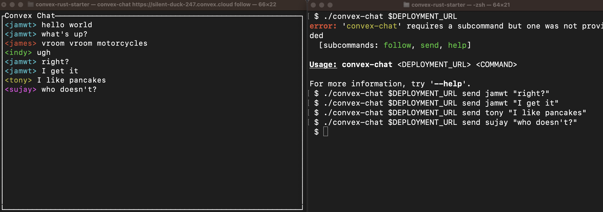

# Convex Rust Starter Project

This project contains a simple convex-chat backend implementation in `convex/`,
as well as a Rust command line program in `src/` that can either watch the chat
channel or send a message.

## How to build

First, set up the Convex project and run the Convex client daemon:

    npm i
    npx convex dev

Then, grab your deployment URL out of `.env.local`.

Finally, run the rust app!

    # In one terminal window, subscribe and watch the chat messages
    $ cargo run -- $DEPLOYMENT_URL follow
    # In another terminal window, send chat messages
    $ cargo run -- $DEPLOYMENT_URL send my_name "Hi there!"
